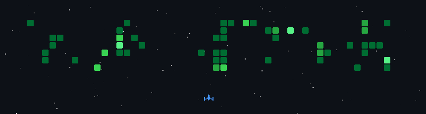

# 💫 About Me:
# Hi, I am Manjunath Patil
3rd year Information Science and Engineering student at Ramaiah Institute of Technology (MSRIT), Bengaluru. I build AI agents, full stack products, and developer tooling, and I compete in hackathons and CTFs on the side.

## 🌐 Socials:
    

# 💻 Tech Stack:
                          

## 🏆 Hacktoberfest Supercontributor

## 🎮 My GitHub Space Shooter Game

### ✍️ Random Dev Quote

